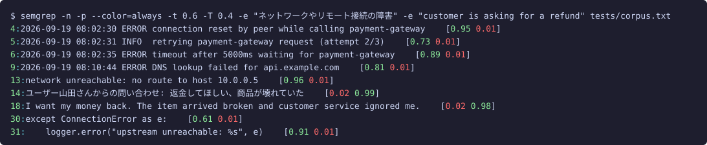

# semgrep — grep by meaning

[日本語版はこちら](README.ja.md)

A grep that finds lines by **what they mean**, not by regular expressions.
Matching is done by **Jev**, the System One model from [TypeSafe AI](https://typesafe.ai/).
Jev does not generate text. It answers typed questions with probabilities, so for every line
semgrep asks "does this line match the meaning *network failure*?", gets a probability back,
and applies a threshold.

```sh
./semgrep -n -e "customer is angry or frustrated" tickets.txt
```

- Zero dependencies. One file, Node.js 20.12+ and `fetch`.
- Fast. 30 lines go into one request, requests run 8 at a time. A 210-line file finishes in under a second.
- Meanings combine with AND / OR / NOT.
- **Cross-lingual.** Write the meaning in Japanese and find English lines, or the other way round. No translation step, same speed, same cost.

## Search across languages

The meaning and the text do not have to share a language. Jev compares concepts, not words,
so one query finds matching lines in every language the file contains.

An **English** meaning finds **Japanese** lines. None of the hits contain "angry" or "frustrated", and two of them are in Japanese:

```sh
$ ./semgrep -n -e "customer is angry or frustrated" tests/corpus.txt
14:ユーザー山田さんからの問い合わせ: 返金してほしい、商品が壊れていた
16:ユーザー佐藤さんからの問い合わせ: 注文した覚えのない請求が来ています。至急確認してください
18:I want my money back. The item arrived broken and customer service ignored me.
21:Your product ruined my weekend. Never buying from you again.
23:This is the third time I'm writing. Nobody has replied to my previous emails.
```

A **Japanese** meaning finds **English** lines, with the same confidence as the Japanese ones:

```sh
$ ./semgrep -n -p -e "返金の要求" tests/corpus.txt
14:ユーザー山田さんからの問い合わせ: 返金してほしい、商品が壊れていた	[0.97]
18:I want my money back. The item arrived broken and customer service ignored me.	[0.95]
```

This makes semgrep useful for mixed-language logs and ticket dumps, and for teams whose members
query in different languages. One caveat: TypeSafe documents English as the most accurate language,
and in our tests Japanese meanings wobble a little more near the threshold. When a query is borderline,
phrasing the meaning in English is the safer choice.

## Install

Requires Node.js 20.12 or later. No other dependencies.

```sh
npm install -g @uehaj/semgrep
semgrep --help
```

Then give it an API key from the [TypeSafe console](https://console.typesafe.ai/). Any one of these works:

```sh
export TYPESAFE_API_KEY=your-key                      # environment variable
echo 'TYPESAFE_API_KEY=your-key' > ~/.config/semgrep/.env   # per user (mkdir -p first)
echo 'TYPESAFE_API_KEY=your-key' > .env               # per project, read from the current directory
```

Lookup order is the environment variable, then `$SEMGREP_ENV`, `./.env`, `~/.config/semgrep/.env`.

From source: `git clone https://github.com/uehaj/jev-semgrep.git && cd jev-semgrep && npm install -g .`,
or run it in place with `node semgrep.mjs ...`.

> The name collides with the static-analysis tool [Semgrep](https://semgrep.dev/). Rename one of them if you use both.

## Examples

All examples run against [`tests/corpus.txt`](tests/corpus.txt), a 51-line mix of server logs,
support tickets in English and Japanese, source code, SQL and small talk.

### Find lines by a concept, in any language

```sh
$ ./semgrep -n -e "customer is angry or frustrated" tests/corpus.txt
14:ユーザー山田さんからの問い合わせ: 返金してほしい、商品が壊れていた
16:ユーザー佐藤さんからの問い合わせ: 注文した覚えのない請求が来ています。至急確認してください
18:I want my money back. The item arrived broken and customer service ignored me.
21:Your product ruined my weekend. Never buying from you again.
23:This is the third time I'm writing. Nobody has replied to my previous emails.
5/51 lines, 2 requests, 3225 input tokens
```

None of these lines contain the words "angry" or "frustrated". The Japanese lines were found by an English meaning.

### OR: two meanings, and see the probabilities with `-p`

```sh
$ ./semgrep -n -p -e "返金の要求" -e "配送先の変更依頼" tests/corpus.txt
14:ユーザー山田さんからの問い合わせ: 返金してほしい、商品が壊れていた	[0.97 0.02]
17:ユーザー高橋さんからの問い合わせ: 配送先の住所を変更したいのですが	[0.01 0.96]
18:I want my money back. The item arrived broken and customer service ignored me.	[0.96 0.01]
22:Can I change the delivery address for order #8821?	[0.02 0.96]
4/51 lines, 2 requests, 4602 input tokens
```

The bracket shows one probability per meaning, in the order given. Use it to pick a threshold.

With `--color` (on by default in a terminal) the probabilities are colored against the thresholds:
green at or above `-t`, red below `-T`, yellow in between. Line numbers and file names use grep's colors.



### AND NOT: network errors, excluding retries

```sh
$ ./semgrep -n -e "network or remote connection failure" -v "a retry is happening or was attempted" tests/corpus.txt
4:2026-09-19 08:02:30 ERROR connection reset by peer while calling payment-gateway
6:2026-09-19 08:02:35 ERROR timeout after 5000ms waiting for payment-gateway
9:2026-09-19 08:10:44 ERROR DNS lookup failed for api.example.com
11:2026-09-19 09:00:00 ERROR SSL handshake failed: certificate expired
13:network unreachable: no route to host 10.0.0.5
30:except ConnectionError as e:
31:    logger.error("upstream unreachable: %s", e)
7/51 lines, 2 requests, 5112 input tokens
```

Line 5, `retrying payment-gateway request (attempt 2/3)`, is a network failure but is dropped by `-v`.

### Mixed: (finance AND negative) OR weather

```sh
$ ./semgrep -n -e "about economy, finance or markets" -a "the news is negative or a decline" -e "about weather" tests/corpus.txt
36:今日の天気は晴れ、最高気温は28度です
43:Stock prices fell 3% after the earnings report missed expectations.
48:明日は雨の予報なので傘を持っていきます
3/51 lines, 2 requests, 5673 input tokens
```

`The central bank raised interest rates` is about finance but not a decline, so it is out.

### Strictness presets

```sh
$ ./semgrep --level strict -n -e "a security risk or dangerous destructive operation" tests/corpus.txt
33:DROP TABLE sessions;
49:API keys must never be committed to the repository.

$ ./semgrep --level loose -n -e "a security risk or dangerous destructive operation" tests/corpus.txt
11:2026-09-19 09:00:00 ERROR SSL handshake failed: certificate expired
16:ユーザー佐藤さんからの問い合わせ: 注文した覚えのない請求が来ています。至急確認してください
33:DROP TABLE sessions;
49:API keys must never be committed to the repository.
```

`strict` keeps only what the model is sure about. `loose` also pulls in the expired certificate and the suspicious-billing ticket.

### Recursive search and file names only

```sh
$ ./semgrep -r -n -e "customer is asking for a refund" docs/
docs/tickets/a.txt:7:ユーザー山田さんからの問い合わせ: 返金してほしい、商品が壊れていた
docs/tickets/sub/b.txt:1:The customer wants a refund for the broken lamp.

$ ./semgrep -rl -e "customer is asking for a refund" docs/
docs/tickets/a.txt
docs/tickets/sub/b.txt
```

`-r` walks directories in sorted order and skips `.git`, `node_modules` and binary files (a NUL byte in the
first 8 KB). Each line still costs API tokens, so point it at a directory you mean to scan. `-l` prints each
matching file once, in the order matches are found, and works with or without `-r`.

### Everything that is *not* something

```sh
./semgrep -v "a timestamped server log line" mixed.txt   # like grep -v
./semgrep -e "source code or SQL" -v "SQL" src.txt       # code, but not SQL
cat app.log | ./semgrep -e "the deploy failed or was rolled back"
```

## Usage

```
usage: semgrep [OPTION]... -e MEANING [-a MEANING] [-v MEANING]... [FILE...]

  -e MEANING   lines matching this meaning (several -e are OR'd)
  -a MEANING   AND onto the preceding -e term.      -e A -a B -e C  =  (A and B) or C
  -v MEANING   AND NOT onto the preceding -e term.  -e A -v B       =  A and not B
               At the front it is a bare negation.  -v B            =  not B  (like grep -v)
  !MEANING     a leading ! negates just that meaning, in -e / -a / -v alike
               -e A -e '!B'  =  A or not B.   -a '!C' is the same as -v C
  --level=LEVEL strictness preset, sets both thresholds (default normal)
                 loose  : -t 0.3 -T 0.7  catch more, accept some noise
                 normal : -t 0.5 -T 0.5
                 strict : -t 0.7 -T 0.3  only confident matches
  -t THRESH    positive threshold: match when probability >= THRESH (overrides --level)
  -T THRESH    negative threshold: "not X" when probability < THRESH (overrides --level)
               with -t 0.6 -T 0.3 a line at 0.3..0.6 matches neither X nor not-X
  -r           recurse into directories (current directory when FILE is omitted);
               skips .git, node_modules and binary files
  -l           print only the names of files with a match, not the lines
  -A NUM       print NUM lines of trailing context after each match (context lines use - as separator)
  -B NUM       print NUM lines of leading context before each match
  -C NUM       print NUM lines of context before and after (-A NUM -B NUM)
  -c LINES     lines per request (default 30)
  -j N         concurrent requests (default 8)
  -n           print line numbers
  -p           print each meaning's probability at the end of the line
  --color[=WHEN] auto (default: color when stdout is a terminal) / always / never; bare --color means auto
               file and line number use grep's colors; with -p, probabilities are
               green at or above the positive threshold, red below the negative one,
               yellow in between. NO_COLOR is honored
  -h, --help   this help
```

Without FILE, stdin is read. With several files, output is prefixed with `file:`.
Exit codes follow grep: 0 matched, 1 no match, 2 bad arguments.

### Expression grammar

`-e` starts an OR term. `-a` and `-v` extend the previous term with AND and AND NOT.
A leading `!` on a meaning negates just that meaning (quote it, `!` is history expansion in most shells).

| command | means |
|---|---|
| `-e A -e B` | A or B |
| `-e A -a B` | A and B |
| `-e A -v B` | A and not B |
| `-e A -a B -v C -e D` | (A and B and not C) or D |
| `-e A -e '!B'` | A or not B |
| `-v B` | not B |

## How it works

1. Non-blank lines are cut into chunks of 30 lines (with a character cap).
2. Each chunk goes into `state` as an object `{"L000": "line 1", "L001": "line 2", ...}`,
   and one `noul` (yes/no probability) question per line × meaning goes into the same request.
3. Up to 8 requests run concurrently. Output is printed in file order.
4. Per line, each meaning's probability is thresholded to a boolean and the AND / OR / NOT expression is evaluated.

Batching does not change the probabilities compared with one line per request
(30 lines in one request take about 0.2 s, one line at a time about 7 s).
Very large chunks start losing lines near the threshold, hence the default of 30.
Probabilities drift by about ±0.05 between runs. Use `-p` when tuning thresholds.

Pricing is $0.042 per million input tokens (September 2026). A 30-line chunk with two meanings is about
3,000 tokens. Throughput is bounded by the rate limit of 1,200 requests per minute, roughly 36,000 lines
per minute at the defaults.

## Tests

`tests/` holds an LLM-as-judge test. Each of the 10 cases in `tests/cases.json` runs against
`tests/corpus.txt` (51 lines). Claude (`claude -p`) decides which lines truly match each meaning;
the runner evaluates the boolean expression on those verdicts and compares with semgrep's output,
reporting precision and recall. It also sweeps `-t` × `-T` in 0.05 steps and reports the best pair.

```sh
node --no-warnings tests/judge.mts [--model sonnet] [--rejudge]
```

Judge verdicts are cached in `tests/verdicts.json`; later runs do not call the judge.
The result is written to `tests/report.md`. Latest: precision 0.94, recall 0.98.

## Limits

- Lines are truncated to 2,000 characters before sending.
- The maximum number of questions per request is undocumented; 420 worked.
- 429 / 529 are retried up to 6 times with exponential backoff.
- Accuracy is best in English. Japanese works but is noisier.

## License

MIT
